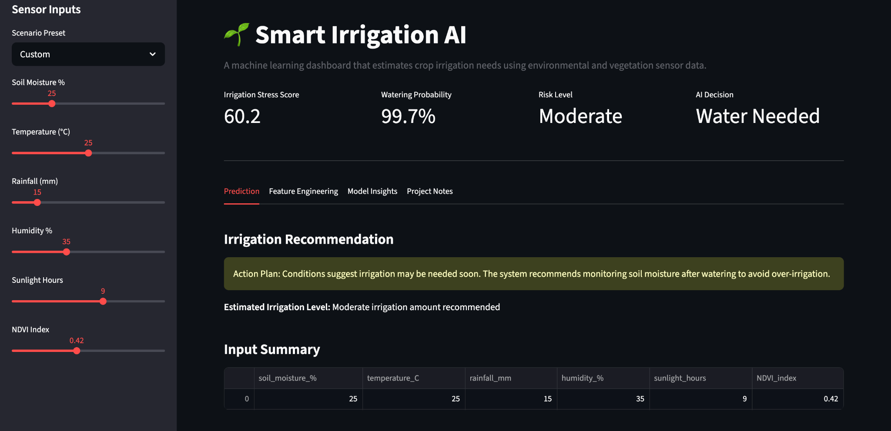

# Smart Irrigation AI

Machine learning project focused on predicting crop irrigation needs using environmental sensor data.

## Live Demo

Try the deployed Smart Irrigation AI dashboard on Hugging Face Spaces:

[Smart Irrigation AI Dashboard](https://huggingface.co/spaces/Sheepydaniel/smart-irrigation-ai-v2)

## Project Write-up

Read the full project write-up on Kaggle:

[Smart Irrigation AI Write-up](https://www.kaggle.com/writeups/shauryajat/smart-irrigation-ai-machine-learning-for-precisio)

## Dashboard Preview

## Overview

Smart Irrigation AI is an applied machine learning project that estimates whether crops may need irrigation based on environmental and vegetation sensor inputs.

The project started as a Kaggle notebook for model exploration and later expanded into a deployed interactive dashboard using Streamlit and Hugging Face Spaces.

The system uses sensor-style inputs such as soil moisture, temperature, rainfall, humidity, sunlight exposure, and NDVI vegetation index to generate:

- an irrigation prediction
- a watering probability
- an irrigation stress score
- a risk level
- human-readable crop condition notes

## Project Structure

This project has three main parts:

| Platform | Purpose |
|---|---|
| Kaggle | Notebook-based model exploration, feature engineering, and evaluation |
| GitHub | Project documentation, code, screenshots, and portfolio repository |
| Hugging Face Spaces | Deployed interactive Streamlit dashboard |

## Dashboard Features

- Interactive sensor input controls
- Scenario presets for different field conditions
- Irrigation stress score
- Watering probability estimate
- Risk level classification
- AI irrigation decision
- Estimated irrigation level
- Engineered feature display
- Feature importance visualization
- Human-readable system notes

## Models Tested

The original notebook compares multiple machine learning models:

- Logistic Regression
- Random Forest Classifier
- Gradient Boosting Classifier

Logistic Regression performed strongly in the notebook, likely because the engineered environmental features created a highly separable irrigation decision boundary.

The deployed dashboard uses a Random Forest classifier with additional engineered features for a more interpretable interactive demo.

## Feature Engineering

The dashboard adds several engineered features to make the prediction more explainable:

| Engineered Feature | Purpose |
|---|---|
| `dryness_index` | Combines low soil moisture, low rainfall, and low humidity |
| `heat_stress_index` | Combines temperature and sunlight exposure |
| `vegetation_risk` | Uses NDVI to estimate possible vegetation stress |
| `combined_irrigation_pressure` | Summarizes overall irrigation demand |

## Dataset Features

The model uses the following environmental inputs:

| Feature | Description |
|---|---|
| `soil_moisture_%` | Soil moisture percentage |
| `temperature_C` | Environmental temperature |
| `rainfall_mm` | Rainfall measurement |
| `humidity_%` | Atmospheric humidity |
| `sunlight_hours` | Daily sunlight exposure |
| `NDVI_index` | Vegetation health indicator |

## Evaluation

The Kaggle notebook evaluates model performance using:

- Accuracy
- Precision
- Recall
- F1 Score
- Confusion Matrix
- Cross-validation
- Feature importance analysis

## Technologies Used

- Python
- Pandas
- NumPy
- Scikit-learn
- Matplotlib
- Streamlit
- Hugging Face Spaces
- Kaggle
- GitHub

## Future Improvements

Planned upgrades include:

- real-time weather API integration
- live IoT sensor support
- larger agricultural dataset training
- crop-specific irrigation thresholds
- historical soil moisture trend visualization
- automated irrigation scheduling
- AI agent-based farm management

## Goal

The goal of this project is to explore how AI and machine learning systems can support precision agriculture, improve water efficiency, and assist smarter environmental resource management.
